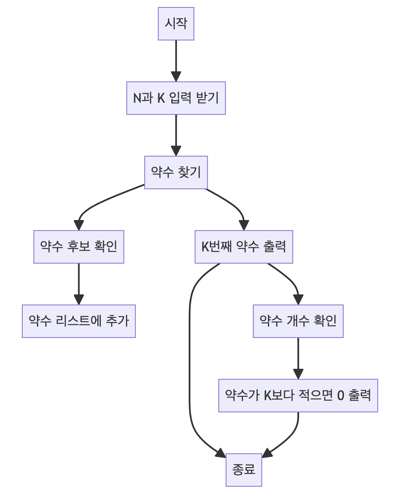

> [CH01_탐색_PART1](../) / [11_DAY01](./)

# BOJ_2501 : 나머지
> https://www.acmicpc.net/problem/2501

## 설계
- 주어진 자연수 N의 K번째 약수를 찾는 문제를 해결
- N의 모든 약수를 찾아 measure 리스트에 저장
- 리스트의 크기와 K를 비교하여 K번째 약수가 존재하는지 확인하고, 존재한다면 해당 약수를 출력
- 만약 K번째 약수가 존재하지 않는다면(즉, 약수의 개수가 K보다 작다면) 0을 출력

## 구현


## 코드
```java
// package boj2501; // 패키지 선언

import java.util.ArrayList; // ArrayList 클래스 사용을 위한 import
import java.util.List; // List 인터페이스 사용을 위한 import
import java.util.Scanner; // Scanner 클래스 사용을 위한 import

public class Main {

    // 메인 메소드
    public static void main(String[] args) {
        Scanner sc = new Scanner(System.in); // 사용자 입력을 받기 위한 Scanner 객체 생성
        int N = sc.nextInt(); // N 입력 받기
        int K = sc.nextInt(); // K 입력 받기
        List<Integer> measure = new ArrayList<>(); // N의 약수를 저장할 리스트 생성
        
        // N의 약수 찾기
        for (int i = 0; i < N; i++) {
            int m = i + 1; // 약수 후보
            if (N % m == 0) { // N을 m으로 나누어 떨어지면 약수
                measure.add(m); // 약수 리스트에 추가
            }
        }
        sc.close(); // Scanner 객체 닫기
        
        // K번째 약수 출력
        // 약수의 개수가 K보다 작으면 0 출력
        if (measure.size() < K) {
            System.out.println(0);
        } else {
            System.out.println(measure.get(K-1)); // K번째 약수 출력 (인덱스는 0부터 시작하므로 K-1)
        }
    }

}
```