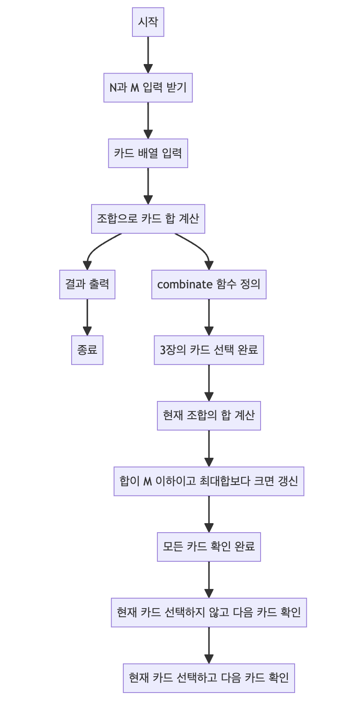

> [CH01_탐색_PART1](../) / [12_DAY02](./)

# BOJ_2798 : 블랙잭
> https://www.acmicpc.net/problem/2798

## 설계
- 카드 게임에서 N장의 카드 중 3장을 고르는 조합을 만들어 M에 가장 가까운 합을 구하는 문제를 해결
- 조합을 재귀적으로 구성하며, 각 조합의 합이 M을 넘지 않는 범위 내에서 최대값을 찾아 sum에 저장
- 모든 조합을 탐색한 뒤, 최종적으로 M에 가장 가까운 합인 sum을 출력

## 구현


## 코드
```java
// package boj2798; // 패키지 선언

//import java.util.Arrays; // Arrays 클래스 사용을 위한 import
import java.util.Scanner; // Scanner 클래스 사용을 위한 import

public class Main {

    // 메인 메소드
    public static void main(String[] args) {
        Scanner sc = new Scanner(System.in); // 사용자 입력을 받기 위한 Scanner 객체 생성
        N = sc.nextInt(); // 카드의 수 N 입력 받기
        // System.out.print(N + " ");
        M = sc.nextInt(); // 목표 합 M 입력 받기
        // System.out.println(M);
        cards = new int[N]; // 카드 배열 초기화
        // N개의 카드 입력 받기
        for (int i = 0; i < N; i++) {
            cards[i] = sc.nextInt();
        }
        sc.close(); // Scanner 객체 닫기
        // System.out.println(Arrays.toString(cards)); // 입력된 카드 배열 출력
        
        // 조합을 사용하여 3장의 카드를 고르고, M에 가장 가까운 카드 합 찾기
        combinate(new int[3], 0, 0); 
        System.out.println(sum); // 결과 출력
    }
    
    static int N; // 카드의 수
    static int M; // 목표 합
    static int[] cards; // 카드 배열
    static int sum = 0; // M에 가장 가까운 카드 합

    // 조합을 생성하는 재귀 함수
    static void combinate(int[] tmp, int index, int depth) {
        // 3장의 카드를 모두 골랐을 때
        if (depth == 3) {
            int sumTmp = tmp[0] + tmp[1] + tmp[2]; // 현재 조합의 합 계산
            // 합이 M 이하이고 현재까지의 최대합보다 크면 갱신
            if (M >= sumTmp && sumTmp > sum) {				
                // System.out.println(Arrays.toString(tmp)); // 현재 조합 출력
                sum = sumTmp; // 최대합 갱신
            }
            return;
        }
        // 모든 카드를 확인했으면 반환
        if (index == N) {
            return;
        }
        // 현재 카드를 선택하지 않고 다음 카드 확인
        combinate(tmp, index + 1, depth);
        // 현재 카드를 선택하고 다음 카드 확인
        tmp[depth] = cards[index];
        combinate(tmp, index + 1, depth + 1);
    }
}
```