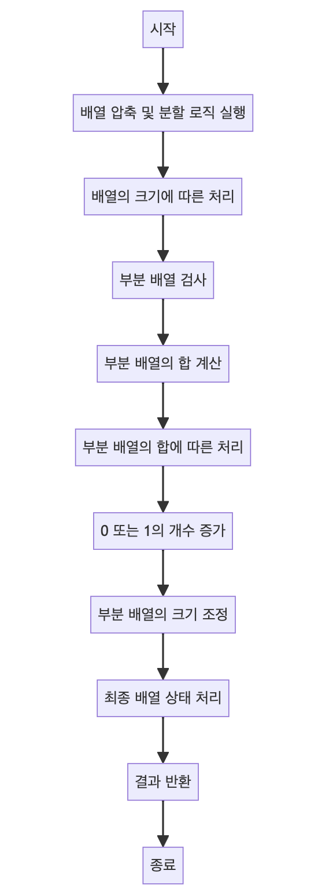

> [CH01_탐색_PART1](../) / [11_DAY01](./)

# 프로그래머스 : 쿼드압축 후 개수 세기
> https://school.programmers.co.kr/learn/courses/30/lessons/68936?language=java

## 설계
- 2D 배열에서 특정 조건에 따라 배열을 작은 단위로 나누고, 각 부분의 합이 전체가 0인지, 1인지를 판단하여 해당 부분을 처리
- 이 과정에서 0과 1의 개수를 세어 answer 배열에 저장하고 반환

## 구현


## 코드
```java
// package pg68936;

import java.util.*;

public class Solution {

	// 메인 메소드
	public static void main(String[] args) {
		int[][] input = { { 1, 1, 0, 0 }, { 1, 0, 0, 0 }, { 1, 0, 0, 1 }, { 1, 1, 1, 1 } };
		System.out.println(Arrays.toString(solution(input)));
		int[][] input2 = { { 1, 1, 1, 1, 1, 1, 1, 1 }, { 0, 1, 1, 1, 1, 1, 1, 1 }, { 0, 0, 0, 0, 1, 1, 1, 1 },
				{ 0, 1, 0, 0, 1, 1, 1, 1 }, { 0, 0, 0, 0, 0, 0, 1, 1 }, { 0, 0, 0, 0, 0, 0, 0, 1 },
				{ 0, 0, 0, 0, 1, 0, 0, 1 }, { 0, 0, 0, 0, 1, 1, 1, 1 } };
		System.out.println(Arrays.toString(solution(input2)));
	}

	// 문제 해결을 위한 solution 메소드
	public static int[] solution(int[][] arr) {
		// 주어진 배열 출력
		// Arrays.stream(arr).forEach((v) -> System.out.println(Arrays.toString(v)));
		int[] answer = new int[2]; // 결과를 저장할 배열 (0과 1의 개수)
		int size = arr.length; // 배열의 크기

		// 배열을 압축하거나 분할하는 로직
		while (size != 1) {
			// 현재 배열의 크기 출력
			// System.out.println("size " + size);
			// 주어진 배열을 size 크기의 부분 배열로 나누어 검사
			for (int i = 0; i < arr.length; i += size) {
				for (int j = 0; j < arr.length; j += size) {
					int sum = 0; // 부분 배열의 합
					// 각 부분 배열을 순회하며 합 계산
					for (int r = 0; r < size; r++) {
						for (int c = 0; c < size; c++) {
							int cursor = arr[i + r][j + c];
							// 현재 값 출력
							// System.out.print(cursor + " ");
							// 부분 배열의 합 계산
							if (cursor != -1) {
								sum += cursor;
							}
						}
						System.out.println();
					}
					// 부분 배열의 합에 따라 처리
					// 전체가 0인 경우
					if (sum == 0) {
						if (arr[i][j] == -1) {
							continue;
						}
						answer[0]++; // 0의 개수 증가
						// 처리된 부분을 -1로 표시
						for (int r = 0; r < size; r++) {
							for (int c = 0; c < size; c++) {
								arr[i + r][j + c] = -1;
							}
						}
					}
					// 전체가 1인 경우
					if (sum == Math.pow(size, 2)) {
						answer[1]++; // 1의 개수 증가
						// 처리된 부분을 -1로 표시
						for (int r = 0; r < size; r++) {
							for (int c = 0; c < size; c++) {
								arr[i + r][j + c] = -1;
							}
						}
					}
				}
			}
			// 부분 배열의 크기를 절반으로 줄임
			size /= 2;
		}
		// 최종적으로 처리되지 않은 원소에 대한 처리
		for (int i = 0; i < arr.length; i++) {
			for (int j = 0; j < arr.length; j++) {
				if (arr[i][j] != -1) {
					answer[arr[i][j]]++;
				}
			}
		}
		// 최종 배열 상태 출력
		// Arrays.stream(arr).forEach((v) -> System.out.println(Arrays.toString(v)));
		return answer; // 결과 반환
	}

}
```