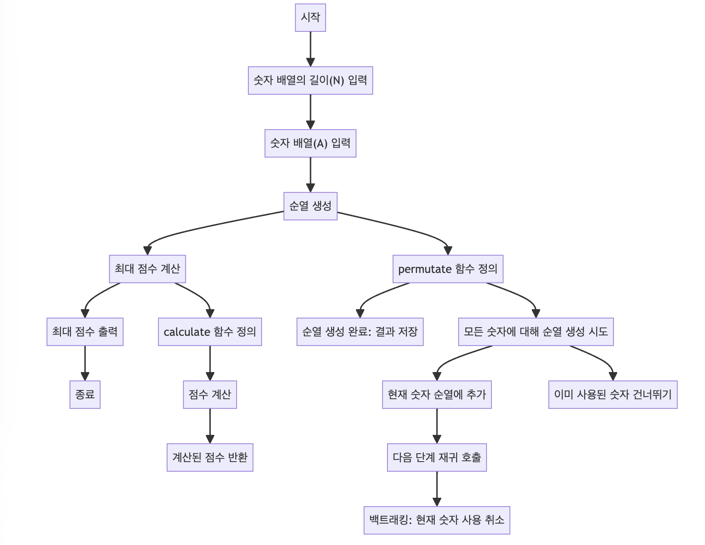

> [CH01_탐색_PART1](../) / [14_DAY04](./)

# BOJ_10819 : 차이를 최대로
> https://www.acmicpc.net/problem/10819

## 설계
- 주어진 배열 A의 모든 순열을 생성하고, 각 순열에 대해 인접한 원소들의 차이의 절대값의 합을 계산하여 그 합이 최대가 되는 순열을 찾음
- 순열을 생성하는 permutate 메소드는 재귀적으로 배열의 각 위치에 들어갈 수 있는 숫자를 시도하면서 순열을 완성
    - 각 단계에서 사용되지 않은 숫자를 찾아 순열의 현재 위치에 넣고, 다음 위치를 채우기 위해 다시 자기 자신을 호출합니다(재귀 호출)
    - 이 과정을 모든 위치가 채워질 때까지 반복하며, 완성된 순열은 permutation 리스트에 저장
- 모든 순열에 대해 점수를 계산하고 최대값을 찾아 출력

## 구현


## 코드
```java
// package boj10819; // 패키지 선언

import java.util.ArrayList; // ArrayList 사용을 위한 import
// import java.util.Arrays; // Arrays 사용을 위한 import
import java.util.List; // List 사용을 위한 import
import java.util.Scanner; // Scanner 사용을 위한 import

public class Main {

    // 메인 메소드
    public static void main(String[] args) {
        Scanner scanner = new Scanner(System.in); // 사용자 입력을 받기 위한 Scanner 객체 생성
        int N = scanner.nextInt(); // 숫자 배열의 길이 N 입력
        r = N; // 순열의 길이 (전역변수)
        int A[] = new int[N]; // 숫자 배열 A 초기화
        // 숫자 배열 A에 값 입력
        for (int i = 0; i < N; i++) {
            A[i] = scanner.nextInt(); // 입력된 숫자를 배열에 저장
        }
        // System.out.println(Arrays.toString(A)); // 입력된 배열 출력
        
        // A 배열의 순열 생성
        permutate(A, new int[N], new boolean[N], 0); // 순열 생성 함수 호출
        // System.out.println(permutation.size()); // 생성된 순열의 개수 출력
        
        // 생성된 순열 출력
        // for (String s : permutation.stream().map(Arrays::toString).toList()) {
        //     System.out.println(s);
        // }
        
        // 각 순열에 대한 점수 계산 및 최대값 찾기
        int result = 0; // 최대 점수 초기화
        for (int[] p : permutation) {
            int c = calculate(p); // 현재 순열의 점수 계산
            // System.out.println(c); // 점수 출력
            result = result < c ? c : result; // 최대 점수 갱신
        }
        System.out.println(result); // 최대 점수 출력
        scanner.close(); // Scanner 객체 닫기
    }

    static List<int[]> permutation = new ArrayList<>(); // 생성된 순열을 저장할 리스트
    static int r; // 순열의 길이

    // 배열의 점수를 계산하는 메소드
    public static int calculate(int[] arr) {
        int sum = 0; // 점수 합계 초기화
        // 인접한 원소들의 차이의 절대값의 합 계산
        for (int i = 0; i < arr.length - 1; i++) {
            sum += Math.abs(arr[i] - arr[i + 1]);
        }
        return sum; // 계산된 점수 반환
    }

    // 순열을 생성하는 재귀 함수
    public static void permutate(int[] arr, int[] temp, boolean[] visited, int depth) {
        // System.out.print(depth + " "); // 현재 재귀 깊이 출력
        // System.out.println(Arrays.toString(temp)); // 현재까지의 순열 출력
        
        // 순열 생성이 완료되었을 때 결과 리스트에 추가
        if (depth == r) {
            permutation.add(temp.clone()); // temp 배열을 복사하여 추가
            return;
        }
        // 각 숫자에 대해 순열 생성 시도
        for (int i = 0; i < arr.length; i++) {
            if (visited[i]) {
                continue; // 이미 사용된 숫자는 건너뜀
            }
            temp[depth] = arr[i]; // 현재 숫자를 순열에 추가
            visited[i] = true; // 현재 숫자를 사용한 것으로 표시
            permutate(arr, temp.clone(), visited.clone(), depth + 1); // 다음 단계 재귀 호출
            visited[i] = false; // 현재 숫자의 사용을 취소 (백트래킹)
        }
    }

}
```